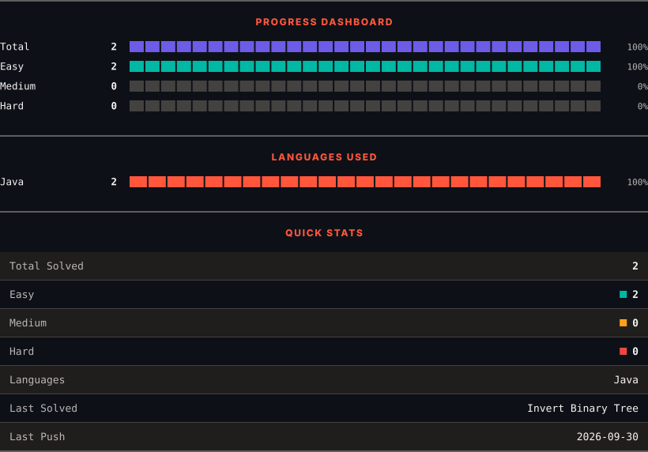
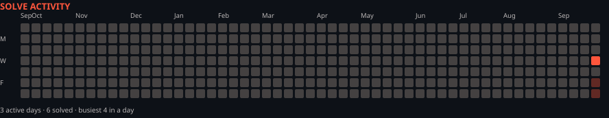

<div align="center">

<h1>LeetCode Solutions</h1>
<p><em>Automatically synced with every accepted submission</em></p>

   

<picture>
  <source media="(prefers-color-scheme: dark)" srcset=".leetsync/stats-dark.svg">
  <source media="(prefers-color-scheme: light)" srcset=".leetsync/stats-light.svg">
  
</picture>

<picture>
  <source media="(prefers-color-scheme: dark)" srcset=".leetsync/calendar-dark.svg">
  <source media="(prefers-color-scheme: light)" srcset=".leetsync/calendar-light.svg">
  
</picture>

</div>

---

## 📊 Progress

<!-- PROGRESS_START -->

| Metric          | Count |
| :-------------- | ----: |
| 🧩 Total Solved | **3** |
| 🟢 Easy         | **3** |
| 🟡 Medium       | **0** |
| 🔴 Hard         | **0** |

**Primary DSA Language:** `Java`

<!-- PROGRESS_END -->

---

<div align="center">

### ALL SOLUTIONS

</div>

<!-- SOLUTIONS_START -->

|  #  | Problem                                                | Difficulty | Language |    Date    |              Time (IST)             |
| :-: | :----------------------------------------------------- | :--------: | :------: | :--------: | :---------------------------------: |
|  1  | [Two Sum](problems/0001-Two-Sum)                       |   🟩 Easy  |  `Java`  | 2026-09-30 | **Actual LeetCode submission time** |
| 101 | [Symmetric Tree](problems/0101-Symmetric-Tree)         |   🟩 Easy  |  `Java`  | 2026-09-30 | **Actual LeetCode submission time** |
| 226 | [Invert Binary Tree](problems/0226-Invert-Binary-Tree) |   🟩 Easy  |  `Java`  | 2026-09-30 | **Actual LeetCode submission time** |

<!-- SOLUTIONS_END -->

---

## 🧠 Learning Template

For problems where I add my own explanation:

```text
Problem
    ↓
Core Idea
    ↓
Algorithm Notes
    ↓
Workflow / Approach
    ↓
Java Code
    ↓
Dry Run
    ↓
Time Complexity
    ↓
Space Complexity
```

---

## 📂 Repository Structure

```text
DSA-LeetCode/
│
├── problems/
│   ├── 0001-Two-Sum/
│   ├── 0101-Symmetric-Tree/
│   ├── 0226-Invert-Binary-Tree/
│   └── ...
│
├── .leetsync/
│   ├── stats-dark.svg
│   ├── stats-light.svg
│   ├── calendar-dark.svg
│   └── calendar-light.svg
│
└── README.md
```

---

<div align="center">

<sub>Auto-synced by <strong>LeetSync</strong> · Built by <a href="https://deveshsamant.in/">Devesh Samant</a></sub>

</div>
