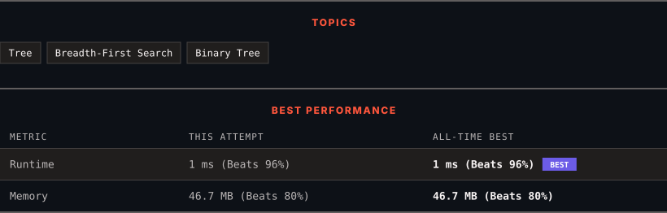

<div align="center">

# 102. Binary Tree Level Order Traversal

      

[](https://leetcode.com/problems/binary-tree-level-order-traversal/)

</div>

---

<div align="center">

<picture>
  <source media="(prefers-color-scheme: dark)" srcset="panel-dark.svg">
  <source media="(prefers-color-scheme: light)" srcset="panel-light.svg">
  
</picture>

</div>

> **New personal best** — Runtime improved on this submission.

### HOW IT WENT

| | |
|:--|:--|
| **Attempts** | first try |
| **Time to solve** | under a minute |
| **Verdicts** | ✅ Accepted |

---

### NOTES

_No notes yet._

---

### SOLUTIONS (1)

| # | File | Language | Date |
|:-:|------|:--------:|:----:|
| 1 | [sol1.java](./sol1.java) | `Java` | 2026-10-01 ← **latest** |

---

### PROBLEM DESCRIPTION

Given the `root` of a binary tree, return *the level order traversal of its nodes' values*. (i.e., from left to right, level by level).

 

**Example 1:**


```

**Input:** root = [3,9,20,null,null,15,7]
**Output:** [[3],[9,20],[15,7]]

```

**Example 2:**

```

**Input:** root = [1]
**Output:** [[1]]

```

**Example 3:**

```

**Input:** root = []
**Output:** []

```

 

**Constraints:**

	- The number of nodes in the tree is in the range `[0, 2000]`.

	- `-1000 <= Node.val <= 1000`

---

<div align="center">

<sub>Auto-synced by <strong>LeetSync</strong> · Built by <a href="https://deveshsamant.in/">Devesh Samant</a></sub>

</div>
