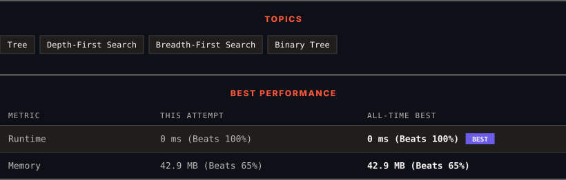

<div align="center">

# 226. Invert Binary Tree

      

[](https://leetcode.com/problems/invert-binary-tree/)

</div>

---

<div align="center">

<picture>
  <source media="(prefers-color-scheme: dark)" srcset="panel-dark.svg">
  <source media="(prefers-color-scheme: light)" srcset="panel-light.svg">
  
</picture>

</div>

> **New personal best** — Runtime improved on this submission.

### HOW IT WENT

| | |
|:--|:--|
| **Attempts** | first try |
| **Time to solve** | under a minute |
| **Verdicts** | ✅ Accepted |

---

### NOTES

_No notes yet._

---

### SOLUTIONS (1)

| # | File | Language | Date |
|:-:|------|:--------:|:----:|
| 1 | [sol1.java](./sol1.java) | `Java` | 2026-09-30 ← **latest** |

---

### PROBLEM DESCRIPTION

Given the `root` of a binary tree, invert the tree, and return *its root*.

 

**Example 1:**


```

**Input:** root = [4,2,7,1,3,6,9]
**Output:** [4,7,2,9,6,3,1]

```

**Example 2:**


```

**Input:** root = [2,1,3]
**Output:** [2,3,1]

```

**Example 3:**

```

**Input:** root = []
**Output:** []

```

 

**Constraints:**

	- The number of nodes in the tree is in the range `[0, 100]`.

	- `-100 <= Node.val <= 100`

---

<div align="center">

<sub>Auto-synced by <strong>LeetSync</strong> · Built by <a href="https://deveshsamant.in/">Devesh Samant</a></sub>

</div>
