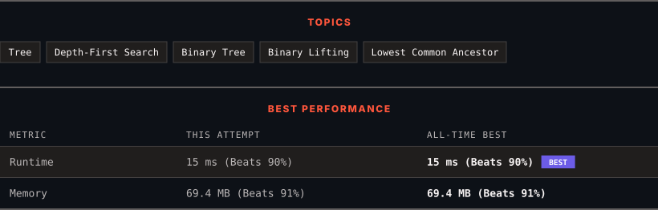

<div align="center">

# 236. Lowest Common Ancestor of a Binary Tree

      

[](https://leetcode.com/problems/lowest-common-ancestor-of-a-binary-tree/)

</div>

---

<div align="center">

<picture>
  <source media="(prefers-color-scheme: dark)" srcset="panel-dark.svg">
  <source media="(prefers-color-scheme: light)" srcset="panel-light.svg">
  
</picture>

</div>

> **New personal best** — Runtime improved on this submission.

### HOW IT WENT

| | |
|:--|:--|
| **Attempts** | first try |
| **Time to solve** | 5 h 6 min |
| **Verdicts** | ✅ Accepted |

---

### NOTES

_No notes yet._

---

### SOLUTIONS (1)

| # | File | Language | Date |
|:-:|------|:--------:|:----:|
| 1 | [sol1.java](./sol1.java) | `Java` | 2026-10-10 ← **latest** |

---

### PROBLEM DESCRIPTION

Given a binary tree, find the lowest common ancestor (LCA) of two given nodes in the tree.

According to the [definition of LCA on Wikipedia](https://en.wikipedia.org/wiki/Lowest_common_ancestor): &ldquo;The lowest common ancestor is defined between two nodes `p` and `q` as the lowest node in `T` that has both `p` and `q` as descendants (where we allow **a node to be a descendant of itself**).&rdquo;

 

**Example 1:**


```

**Input:** root = [3,5,1,6,2,0,8,null,null,7,4], p = 5, q = 1
**Output:** 3
**Explanation:** The LCA of nodes 5 and 1 is 3.

```

**Example 2:**


```

**Input:** root = [3,5,1,6,2,0,8,null,null,7,4], p = 5, q = 4
**Output:** 5
**Explanation:** The LCA of nodes 5 and 4 is 5, since a node can be a descendant of itself according to the LCA definition.

```

**Example 3:**

```

**Input:** root = [1,2], p = 1, q = 2
**Output:** 1

```

 

**Constraints:**

	- The number of nodes in the tree is in the range `[2, 10^5]`.

	- `-10^9 <= Node.val <= 10^9`

	- All `Node.val` are **unique**.

	- `p != q`

	- `p` and `q` will exist in the tree.

---

<div align="center">

<sub>Auto-synced by <strong>LeetSync</strong> · Built by <a href="https://deveshsamant.in/">Devesh Samant</a></sub>

</div>
