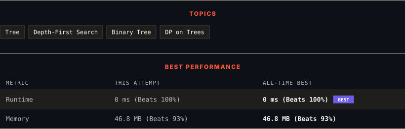

<div align="center">

# 543. Diameter of Binary Tree

      

[](https://leetcode.com/problems/diameter-of-binary-tree/)

</div>

---

<div align="center">

<picture>
  <source media="(prefers-color-scheme: dark)" srcset="panel-dark.svg">
  <source media="(prefers-color-scheme: light)" srcset="panel-light.svg">
  
</picture>

</div>

> **New personal best** — Runtime improved on this submission.

### HOW IT WENT

| | |
|:--|:--|
| **Attempts** | first try |
| **Time to solve** | under a minute |
| **Verdicts** | ✅ Accepted |

---

### NOTES

_No notes yet._

---

### SOLUTIONS (1)

| # | File | Language | Date |
|:-:|------|:--------:|:----:|
| 1 | [sol1.java](./sol1.java) | `Java` | 2026-10-07 ← **latest** |

---

### PROBLEM DESCRIPTION

Given the `root` of a binary tree, return *the length of the **diameter** of the tree*.

The **diameter** of a binary tree is the **length** of the longest path between any two nodes in a tree. This path may or may not pass through the `root`.

The **length** of a path between two nodes is represented by the number of edges between them.

 

**Example 1:**


```

**Input:** root = [1,2,3,4,5]
**Output:** 3
**Explanation:** 3 is the length of the path [4,2,1,3] or [5,2,1,3].

```

**Example 2:**

```

**Input:** root = [1,2]
**Output:** 1

```

 

**Constraints:**

	- The number of nodes in the tree is in the range `[1, 10^4]`.

	- `-100 <= Node.val <= 100`

---

<div align="center">

<sub>Auto-synced by <strong>LeetSync</strong> · Built by <a href="https://deveshsamant.in/">Devesh Samant</a></sub>

</div>
